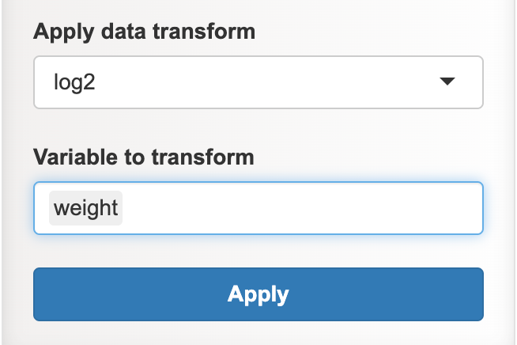

```{r setup, include=FALSE}
knitr::opts_chunk$set(echo = FALSE)
library(tidyverse)
library(flextable)
```

<h3 style="text-align: center;">**Data management related**</h3>


<h4 style="text-align: left;">**Input data**</h4>

<p style="font-size:20px;"> 
<font size = "4">
Two choice

1. **Example**

2. **Upload** : valid file format for upload : _csv, tsv, txt, xlsx,_ or _rds_


Under the **Example** option, three datasets are provided to enable users to conduct exploratory tasks using the application. These datasets serve as representations of the data formats supported by the application. The **wide** and **long format** datasets essentially contain the same data but are presented in different structures. The wide format is particularly suitable for generating scatter and line graphs. On the other hand, the **replicate** data features a structure with two headers and pairs of replicates for both the _"control"_ and _"treatment"_ variables. 

_Data with replicates can have more than one header. Such data necessitates further processing before it can be utilized for plotting figures._

</font>
</p>

<div style = "display:flex;  justify-content:center; text-align:center">
<table style="width: 50%; table-layout: fixed;">
  <tr>
    <td style="width: 50%; padding: 5px;">
      <p style = "text-align:center"><b>Example datasets</b></p>
    </td>
    <td style="width: 50%; padding: 5px;">
       <p style = "text-align:center"><b>Upload</b></p>
    </td>
  </tr>
</table>
</div>


<h4 style="text-align: left;">**Handle missing data**</h4>


<p> 
<font size = "4">
When uploading data, users have the option to specify _single_ or _multiple_ missing values. **Specifying multiple missing values must be comma separated**.

Three approaches to manage missing data:

1. **Replaced with 0** : It is the default setting. It will replaced specified missing values with _0_.

2. **Removed NA** : It will eliminate the entire rows containing missing data. _It's important to exercise caution when opting for this option._

3. **Impute methods** : A selection of 10 imputation methods are available, which have been categorized into two groups: common and advance. This classification is solely for organization and doesn't imply any hierarchy among the methods.

 Selecting suitable imputation methods for your data is crucial. For comprehensive guidance on handling missing data, you can explore the freely available resource titled [Flexible Imputation of Missing Data](https://stefvanbuuren.name/fimd/want-the-hardcopy.html)
</font>
</p>

<div style="text-align: center; font-weight:bold;">
  {width=500px, height=200px}
</div>


<h4 style="text-align: left;">**Data with replicate**</h4>


<p>
<font size = "4">
PlotS anticipate replicated data to feature a minimum of two headers. So, it necessitates additional processing. 

1. **Data with replicate/multiple headers?** : Select the **Yes**. This action will unveil a range of input choices designed for data processing. 

2. Ensure correct number of **Header** and **Group/variable**. This is a crucial step. The **Group/variable** denotes the factor by which replicates have to be combined. For instance, in the example dataset, the replicate data features two groups/variables: _control_ and _treatment_. 

3. Provide **Variable name** and **Replicate columns** : By specifying the number of _variables_, the system will prompt for **Variable name** and **Replicate columns**.

4. **Compute mean or median** : Users interested in calculating the **mean** or **median** of pooled replicates can do so by selecting the appropriate options under **Compute**. The system will then prompt for specification of the variable(s) for grouping and performing the chosen computation method. 

5. **Apply** : Upon furnishing all essential inputs, an **Apply** button will be presented. A simple click on this button triggers the initiation of the data processing procedure.


After processing replicate data it will add two new columns : 

 - New column named **replicates**, which will specify to which replicates the data belong to.
 
 - New column using the user-provided _variable name_. Replicate value of independent variable will be placed under it.
 
 In instances where the data features more than one variable with replicates, it's advisable to proceed with reshaping the data for optimal representation and analysis. The processed data will be presented below the original data panel, and will be available for download as a CSV file.

</font>
</p>


<div style = "display:flex;  justify-content:center; text-align:center">
<table style="width: 50%; table-layout: fixed;">
  <tr>
    <td style="width: 50%; padding: 5px;">
      <p style = "text-align:center"><b>Choose "Yes"</b></p>
    </td>
    <td style="width: 50%; padding: 5px;">
       <p style = "text-align:center"><b>Fill the parameters</b></p>
    </td>
  </tr>
</table>
</div>


<h4 style="text-align: left;">**Reshape wide to long format**</h4>

<p>
<font size = "4">
The choice between wide and long data formats depends on the analysis. While wide format is suitable for creating scatter or line graphs, long format is generally preferred for most cases. The primary distinction between wide and long formats lies in the organization of variables. 

In wide format ( _Table 1_), independent variables occupies its own column, with the corresponding dependent values residing within the cells. Conversely, in the long format ( _Table 2_ ), both independent and dependent variables are organized into distinct columns. Opting for the long format allows for the inclusion of multiple variables in separate columns within the dataset. This, in turn, grants the flexibility to dynamically compare variables and analyze data interactively using PlotS.

</font>
</p>


<!-- two table with equal spacing -->
<style>
  .container {
    display: flex;
    justify-content: space-between;
    width: 100%;
  }
  
  .section {
    flex: 1;
    padding: 20px;
    <!-- border: 1px solid #ccc; -->
    <!-- box-sizing: border-box; -->
  }
</style>

<div class="container">
  <div class="section">
    
```{r}

wide_df <- structure(
  list(
    ctrl = c(4.17, 5.58, 5.18, 6.11, 4.5, 4.61, 5.17, 4.53, 5.33, 5.14),
    trt1 = c(4.81, 4.17, 4.41, 3.59, 5.87, 3.83, 6.03, 4.89, 4.32, 4.69),
    trt2 = c(6.31, 5.12, 5.54, 5.5, 5.37, 5.29, 4.92, 6.15, 5.8, 5.26)),
  row.names = c(NA, -10L),
  class = "data.frame"
)

flextable(head(wide_df,3)) %>%
  autofit(add_w = 2) %>%
  add_header(ctrl = "Table 1. Wide format table. Each independent variable forms the columns (ctrl, trt1, trt2) and each cell is the record of dependent variable i.e. weight", top = TRUE) %>%
  merge_at(i = 1, j = 1:ncol(wide_df), part = "header") %>%
  align(i = 1, j = 1:ncol(wide_df), align = "center", part = "header")

```

  </div>
  
  <div class="section">
  
```{r}

long_df <- structure(
  list(
      group = structure(c(1L, 1L, 1L, 2L, 2L, 2L, 3L, 3L, 3L, 3L, 3L, 3L, 3L, 3L, 3L, 3L), levels = c("ctrl", "trt1", "trt2"), class = "factor"),
    value = c(4.17, 5.58, 5.18,  4.81, 4.17, 4.41, 6.31, 5.12, 5.54)),
    class = "data.frame",
    row.names = c(NA, -30L)
)

flextable(head(long_df, 9)) %>%
  autofit(add_w = 2.5) %>%
  add_header(group = "Table 2. Long format table. The independent variables (ctrl, trt1, and trt2) are grouped under the category 'group', while the dependent variable is positioned under 'value'.", top = TRUE) %>%
  merge_at(i = 1, j = 1:ncol(long_df), part = "header") %>%
  align(i = 1, j = 1:ncol(long_df), align = "center", part = "header")


```
  
  </div>
  
</div>
<!-- end of table -->


<p>
<font size = "4">
Wide format can be reshaped into long format by using the **Reshape** feature. The user need to first specify the column to reshape. The name of the chosen columns will serve as the different levels of independent variables, and the corresponding value will be placed in a separate column called "value". The user also need to provide a new name of column for housing the dependent variables. 

<div style="text-align: center; font-weight:bold">
  {width=700px, height=400px}
</div>

</font>
</p>


<h4 style="text-align: left;">**Data transformation**</h4>


<p>
<font size = "4">

The tool provides different methods for transforming data. Here's some details of the feature:

1. **Method selection:** Users can select a data transformation method from a dropdown menu. The available methods are:
   - log2
   - log10
   - square-root
   - box-cox
   - scale

2. **Variable selection:** The tool automatically identifies numeric variables from the input data and generates a list of these variables. Users can select one or more variables from the list to be transformed.

3. **Box-Cox transformation:** The "box-cox" method has a specific requirement. It needs two variables:
   - Categorical variable
   - Numeric variable

4. **Overwriting:** Data transformation will overwrite the other data processing methods (reshaped and replicate data).  

5. **Reverting to original data:** Users can revert to their original data state by selecting the " _none_" option from the transformation method dropdown. 


6. **Transformed data display:** The transformed data will be displayed below the panel of input data. 

7. **Download:** Users can download the transformed data as a CSV file.


</font>
</p>


<div style="text-align: center; font-weight:bold">
  {width=500px, height=200px}
</div>


#### **Type of file format supported in plotS**

 > It support comma separated file (csv), tab delimited (tsv) and excel sheet file (xls and xlsx)


#### **Must the input data be of only numeric columns?**

> No, data can be a combination of numerical and categorical variables.


#### **What is long and wide format, and why to reshape it?**


> Each independent variable forms a column in **wide format**, and each cell or data point in the column is a record of dependent variable (table 1). In other words, each row is a mix of records of dependent value of all the independent variables. In contrast, independent and dependent variables are organised into different columns in **long format**, with each row representing the record of one independent variable (table 2). Arranging the data in long format allow comparisons between the independent variables in PlotS. It can further represent more independent variables, if present, in the graph using aesthetic options. To represent and compare variables in PlotS, reshaping to long format is required and recommended.


<!-- > Reshaping is required depending on the input data so that variables can be compared. In order to represent and compare variables in plotS, the input data must be in **long format** rather than **wide format**. In the example below, _Table 1_ represents the wide format, while _Table 2_ represent the long format. You need to reshape your data if it is in wide format and want to compare between variables (control, treatment1 and treatment2). -->


_Example : the data is a comparison of yield, measured as dried weight of plants, obtained under control and two different treatment conditions. The given three growth conditions are the independent variables and yield is the dependent variable._


```{r}
table1 <- data.frame(sample = c( paste0(rep("sample", 3), 1:3) ), 
                     control = c(sample(20:50, 3)),
                     treatment1 = c(sample(10:40, 3)), treatment2 = c(sample(30:60, 3)))
# knitr::kable(table1

table1 %>% flextable() %>% autofit(add_w = 1) %>% 
add_header(., sample = "Table 1. Wide format table. Each independent variable forms the column and each cell is the record of dependent variable i.e. yield.", top = TRUE) %>%
  merge_at(., i = 1, j = 1:ncol(table1), part = "header") %>%
    align(., i = 1, j = 1:ncol(table1), align = "center", part = "header")

```

<br>
<br>
_Data in the table 1, which is in a wide format, reshaped to long format in table 2._

<br>

```{r}
table2 <- pivot_longer(table1, cols = !sample, names_to = "treatments", values_to = "value")

table2 %>% flextable() %>% autofit(add_w = 1.5) %>% 
add_header(., sample = "Table 2. Long format table. Independent variables (control, treatment1 and treatment2) are organised in the 'treatments' column and dependent variable (yield) is placed under 'value' column.", top = TRUE) %>%
  merge_at(., i = 1, j = 1:ncol(table2), part = "header") %>%
    align(., i = 1, j = 1:ncol(table2), align = "center", part = "header")

```

<br>


#### **What is aesthetic option?**

> Aesthetic options mapped the variables to visual properties - color, shape or line type. It let user customize the visual properties and differentiate between variables. 

#### **What is the statistical methods used for conducting normality test?**


> In PlotS, we used Shapiro-Wilk's test if the sample size is less than 5000, otherwise, Kolmogorov-Smirnov's test is used.


#### **Estimating the effect size**

> Effect size is estimated using different R packages.


> - We used **effectsize** package of R to estimate the effect size of _T-test_ and _ANOVA_.


> - **rstatix** package is used for measuring the effect size of _Wilcoxon_ and _Krukal-Wallis tests_.


#### **Does the app save user data?**

> No, after the session ends, all data is deleted.


#### **R packages used for the application**

- [ggplot2](https://ggplot2.tidyverse.org/) : most of the graphics in this app are created using ggplot2.

- [rmarkdown](https://rmarkdown.rstudio.com/) : creating documents for report.

- [rstatix](https://cran.r-project.org/web/packages/rstatix/index.html) : most of the statistical methods in the app use this pipe-friendly package.

- [shiny](https://shiny.rstudio.com/) : building the interactive web apps.

- [tidyverse](https://www.tidyverse.org/) : collection of R packages for data science.

- other packages:
    - [car](https://cran.r-project.org/web/packages/car/index.html), [coin](https://cran.r-project.org/web/packages/coin/index.html),
[colourpicker](https://github.com/daattali/colourpicker), [data.table](https://cran.r-project.org/web/packages/data.table/index.html), [DT](https://rstudio.github.io/DT/), [effectsize](https://cran.r-project.org/web/packages/effectsize/index.html), [flextable](https://cran.r-project.org/web/packages/flextable/index.html), [ggforce](https://ggforce.data-imaginist.com/), [ggpp](https://cran.r-project.org/web/packages/ggpp/index.html), [ggpubr](https://cran.r-project.org/web/packages/ggpubr/index.html), [ggside](https://github.com/jtlandis/ggside), [glue](https://glue.tidyverse.org/), [MASS](https://cran.r-project.org/web/packages/MASS/index.html), [memoise](https://memoise.r-lib.org/), [mice](https://cran.r-project.org/web/packages/mice/index.html), [multcompView](https://cran.r-project.org/web/packages/multcompView/index.html), [openxlsx](https://ycphs.github.io/openxlsx/), [reactable](https://glin.github.io/reactable/), [readxl](https://readxl.tidyverse.org/), [rlang](https://rlang.r-lib.org/), [scales](https://cran.r-project.org/web/packages/scales/index.html), [shiny.router](https://github.com/Appsilon/shiny.router), [shinyalert](https://github.com/daattali/shinyalert), [shinyBS](https://ebailey78.github.io/shinyBS/), [shinydashboard](https://rstudio.github.io/shinydashboard/), [shinyjqui](https://cran.r-project.org/web/packages/shinyjqui/vignettes/introduction.html), [shinyjs](https://cran.r-project.org/web/packages/shinyjs/vignettes/shinyjs.html), [shinyWidgets](https://shinyapps.dreamrs.fr/shinyWidgets/), [skimr](https://github.com/ropensci/skimr), [svglite](https://www.tidyverse.org/blog/2021/02/svglite-2-0-0/), [vroom](https://www.tidyverse.org/blog/2019/05/vroom-1-0-0/).


