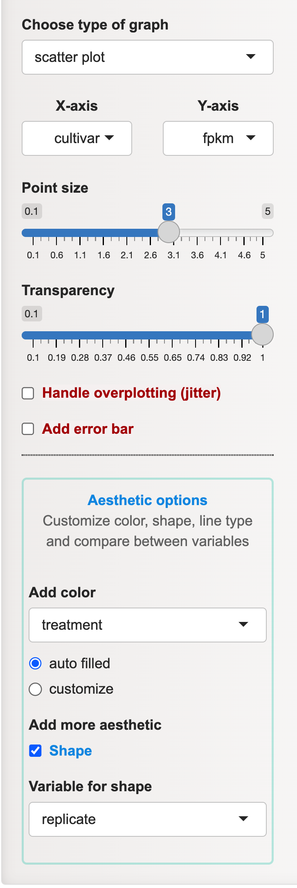
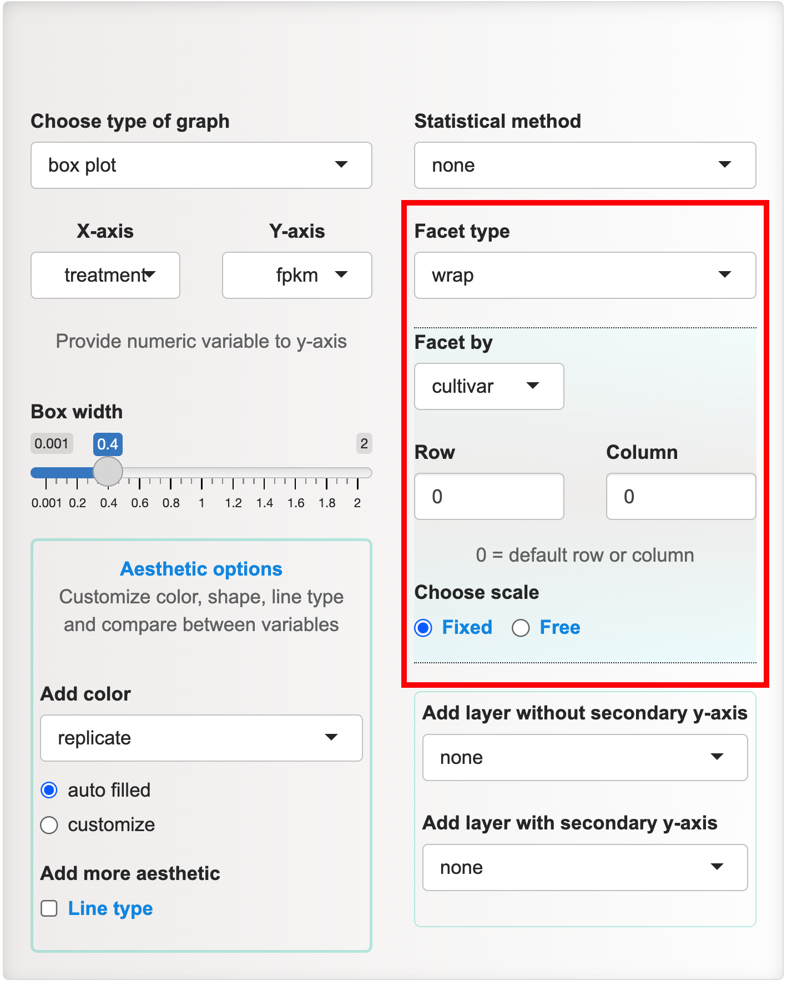
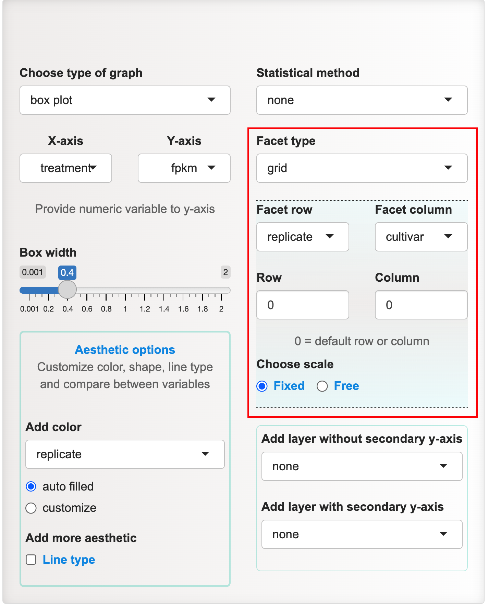
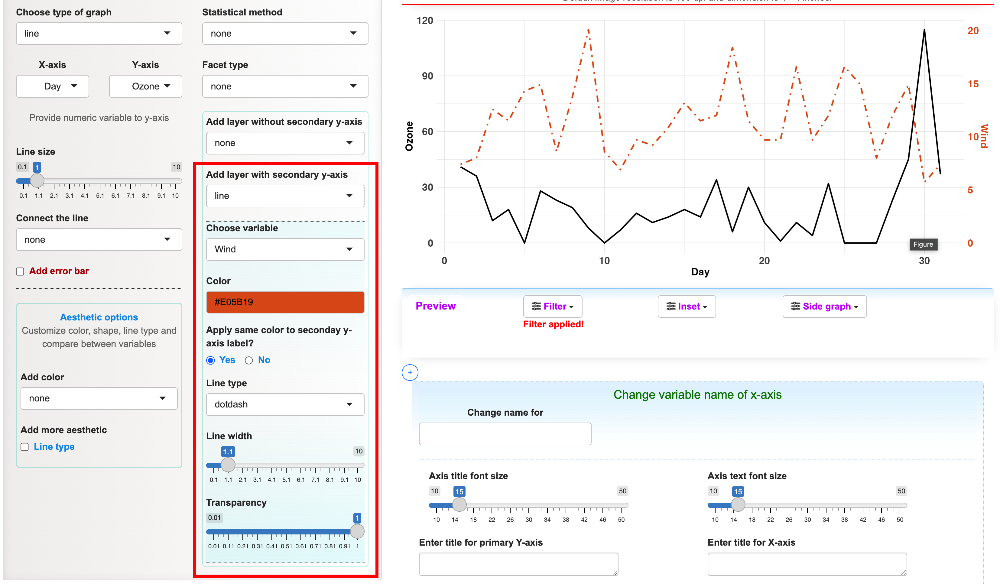
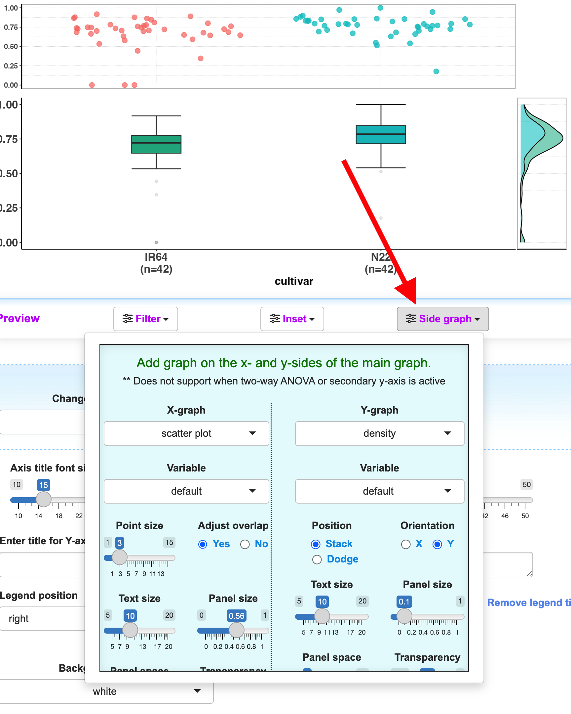
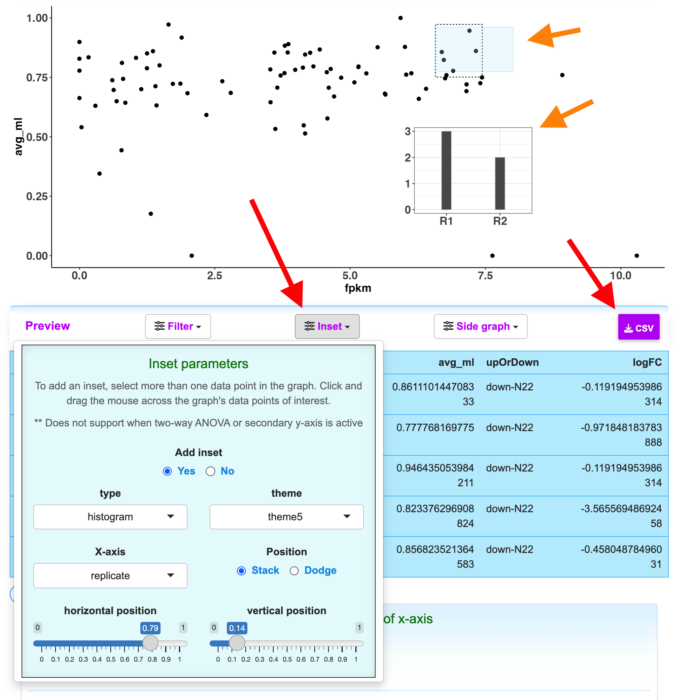
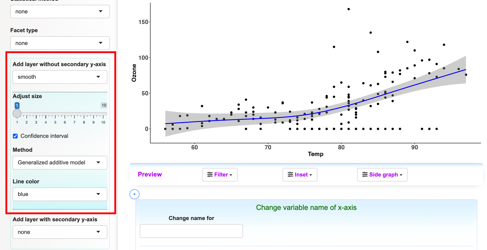

<style>
  .container {
    display: flex;
    justify-content: space-between;
    width: 100%;
    <!-- max-width: 700px; -->
  }
  
  .section {
    flex: 1;
    padding: 30px;
    box-sizing: border-box;
    font-weight: bold;
    text-align:center;
  }
  
  .img{
  border: 1px dotted #ccc;
}

.facet{
  border-top: 1px dotted #ccc;
  border-bottom: 1px dotted #ccc;
  padding-top: 30px;
  padding-bottom: 30px;
  max-height: 500px;
}
</style>


```{r setup, include=FALSE}
knitr::opts_chunk$set(echo = TRUE)
library(tidyverse)
library(flextable)
#general theme
themes <- ggplot2::theme(
  axis.text = element_text(face = 2),
  axis.title = element_text(face =2),
  legend.text = element_text(face =2),
  legend.title = element_text(face = 2),
  strip.text = element_text(face = "bold")
)
```


<h3 style="text-align: center;">**Graph related**</h3>


<h4 style="text-align: left;">**Type of graph**</h4>


<p style="font-size:20px;"> 
<font size = "4">
PlotS presents users with a range of eight graph types to select from:
<ul>
<li>Bar plot</li>
<li>Box plot</li>
<li>Density plot</li>
<li>Frequency polygon</li>
<li>Histogram</li>
<li>Line plot</li>
<li>Scatter plot</li>
<li>Violin plot</li>
</ul>

Certain graph like density, frequency and histogram require only X-axis. The variable for Y-axis for the other remaining graph has to be numeric variable. Users can interactively change the variable for the axes.

</font>
</p>


<br>


<h4 style="text-align: left; color:red;">**Aesthetic option**</h4>

<p style="font-size:20px;"> 
<font size = "4">
The aesthetic choice serves as a valuable function that links a variable to a visual element like color, shape, or line type (dash, dotted, solid). This enables users to add additional variables or differentiate between variables. This functionality equips PlotS to effectively manage a wide range of data variables for analysis, setting it apart from other visualization tools. 

Change color of variables:

1. auto filled - by default PlotS will automatically select color for the chosen variable.

2. customize - users can edit the color. They can either type the color in the text box (comma or space separated) or choose from the color picker provided at the side.


To illustrate **Aesthetic options**, we will use a hypothetical gene expression dataset (refer to _Table 1_) representing two rice cultivars (IR64 and N22) exposed to two types of treatments (t1 and t2), along with a control (c). Each condition has two replicates (R1, R2). Let's create a scatter plot with aesthetic **color** (auto filled) mapped to _treatment_ and **Shape** to _replicate_ of the data. The resulting graphical representation is depicted in _Figure 1_.


</font>
</p>

<!-- 1 table with 1 figure -->
<div class="container">
  <div class="section img">
    
```{r echo=FALSE}

df <- structure(list(cultivar = c("IR64", "IR64", "IR64", "IR64", "IR64", 
"IR64", "N22", "N22", "N22", "N22", "N22", "N22"), treatment = c("t1", 
"t1", "t2", "t2", "c", "c", "t1", "t1", "t2", "t2", "c", "c"), 
    replicate = c("R1", "R2", "R1", "R2", "R1", "R2", "R1", "R2", 
    "R1", "R2", "R1", "R2"), fpkm = c(20.9, 17.75, 5.9, 3.39, 
    7.6, 6.6, 10.37, 11.93, 41.51, 33.64, 23.81, 28.01)), row.names = c(NA, 
-12L), class = c("tbl_df", "tbl", "data.frame"))

flextable(df) %>%
  autofit(add_w = 2) %>%
  add_header(cultivar = "Table 1. Expression data with two replicates of two rice cultivars under different treatment conditions.", top = TRUE) %>%
  merge_at(i = 1, j = 1:ncol(df), part = "header") %>%
  align(i = 1, j = 1:ncol(df), align = "center", part = "header")

```

  </div>

  <div class="section img">
  {width=150px, height=500px}
  </div>

  <div class="section img">
  
```{r echo=FALSE, fig.cap="Figure 1. Scatter plot with the chosen aesthetic elements - color and shape"}
ggplot(data = df, aes(x = cultivar, y = fpkm, color = treatment, shape = replicate)) + 
  geom_point(size =3)+
  theme_classic()+
  labs(x = "Cultivar", y = "Expression")+
  themes
# df
# ggplot(data = df, aes(x = cultivar, y = avg_fpkm, color = treatment, linetype = replicate)) + geom_bar(stat = "identity")+theme_minimal()
```
  
  </div>
  
</div>
<!-- end of table and figure -->

<br>


<h4 style="text-align: left; color:red;">**Visualization of multivariate data**</h4>


<p style="font-size:20px;"> 
<font size = "4">
PlotS offers various features for multivariate analysis in addition to the features provided under **Aesthetic options**. Visualization of the relationship of multiple variables in a data can be done in four ways:

1. Faceting

2. Secondary Y-axis

2. Side graph

3. Inset


<h4 style="text-align: left;">**Faceting**</h4>


Faceting generate sets of visual representations by partitioning data into smaller groups and showcasing identical graphs for each subgroup. 

User has to select the **Facet type**. There are two types: 

1. _wrap_ 

2. _grid_


Users can specify the **number of column and row for facet**. The value "0" signifies the default setting.

To exemplify the feature of faceting, we will utilize the provided _Table 2_. Although the data follows a format akin to _Table 1_, it contains a more comprehensive range of rows, providing a more detailed perspective.

</font>
</p>

<div style = "width:60%; margin: 0 auto; text-align: center">
```{r echo=FALSE, warning=FALSE, message=FALSE}
df_facet <- read_csv("plots_facetData.csv.gz") %>% dplyr::select(-upOrDown)
df_facet$fpkm <- round(df_facet$fpkm, 2)  
DT::datatable(
            as.data.frame(df_facet),  selection = "none",
            options = list(searching = FALSE, pageLength = 5), caption="Table 2. Expression data."
          )
```
</div>


<div class="container">
<div class="section facet">
{width=150px, height=350px}
</div>

<div class="section facet">
```{r, fig.cap="Figure 2. displaying the wrap faceting", echo=FALSE, out.width="100%", out.height="auto"}
ggplot2::ggplot(df_facet, aes(x= treatment, y = log(fpkm+1,2), fill = replicate))+
  stat_boxplot(geom = "errorbar", width = 0.4)+
  geom_boxplot(width = 0.4)+ 
  labs(y = "log2(fpkm)")+
  theme_bw()+
  facet_wrap(.~cultivar)+
  themes
  
```
</div>

</div>

<div class="container">

<div class="section facet">
{width=150px, height=350px}
</div>

<div class="section facet">
```{r, fig.cap="Figure 2. displaying the grid faceting", echo=FALSE, out.width="100%", out.height="auto"}
ggplot2::ggplot(df_facet, aes(x= treatment, y = log(fpkm+1,2), fill = replicate))+
  stat_boxplot(geom = "errorbar", width = 0.4)+
  geom_boxplot(width = 0.4)+ 
  labs(y = "log2(fpkm)")+
  theme_bw()+
  facet_grid(replicate ~cultivar)+
  themes
  
```
</div>

</div>


<h4 style="text-align: left;">**Secondary Y-axis**</h4>


<p style="font-size:20px;"> 
<font size = "4">
**Secondary Y-axis** is to display two sets of data on the same graph, each with its own Y-axis and scale. It is useful for comparing two different types of data that have distinct measurement ranges, or when you want to show relationships between variables that might not be immediately apparent on a single Y-axis

To add the secondary Y-axis:

1. Data must have two numeric variables (or columns)

2. Users have to select any one graph listed under the **Add layer with secondary Y-axis**

</font>
</p>


<div class="section">
{width=300px, height=400px}
</div>


<h4 style="text-align: left;">**Side graph**</h4>


<p style="font-size:20px;"> 
<font size = "4">

The **Side graph** is used to add graphs on the right side (**Y-graph**) and/or the upper side (**X-graph**) of the primary graph. This functionality within PlotS offers an additional and valuable avenue for investigating the relationship between variables. This feature is conveniently located beneath the main graph panel (shown below).

By default, the variables selected for the side graphs are aligned with those assigned to the X-axis and Y-axis of the main graph. However, users have the autonomy to opt for different variables when generating these side graphs.

It's important to note that the **Side graph** feature is not compatible with the **two-way ANOVA** or when the **secondary Y-axis is in use**.

</font>
</p>

<div class="section">
{width=250px, height=550px}
</div>


<!-- inset -->

<h4 style="text-align: left;">**Inset**</h4>

<p style="font-size:20px;"> 
<font size = "4">

**Inset** is to insert a graph within the primary graph. The feature enhances the exploration and presentation of data by enabling users to focus on specific data points while still maintaining an overall view of the dataset. **Inset** panel is also placed below the primary graph panel along with the **Side graph**


1. **Add inset**: Users can easily add an inset graph by using the mouse to select and drag across a specific data point of interest on the primary graph. The corresponding data from that point is then displayed below the panel. This data can also be downloaded as a CSV file.


2. **Add metadata**: The variable displayed in the inset graph can be different from the one in the primary graph. This allows users to incorporate additional contextual information or metadata into the graph.


3. **Toggle Inset**: By default, the **Inset** is turned on, but users can disable it if desired. Enabling the **Inset** will only turn off the display of the inset graph.


</font>
</p>


<div class="section">
{width=250px; height=550px}
</div>


<!-- Add layer without secondary y-axis -->
<h4 style="text-align: left;">**Additional layer without secondary y-axis**</h4>


<p style="font-size:20px;"> 
<fondt size = "4">

It add additional layer over the existing graph, but without secondary y-axis.  It enable user to look for pattern in the data. 

Type of layer:

1. line graph

2. point graph

3. smooth line graph: applicable only when continuous data is provided to X-axis


Methods for plottig smooth line
    
1. Linear regression model (LM)

2. Generalized LM

3. Generalized additive model

4. LOESS : applicable for data having less than 1000 observations
    

</font>
</p>


<div class="section">
{width=250px; height=500px}
</div>
